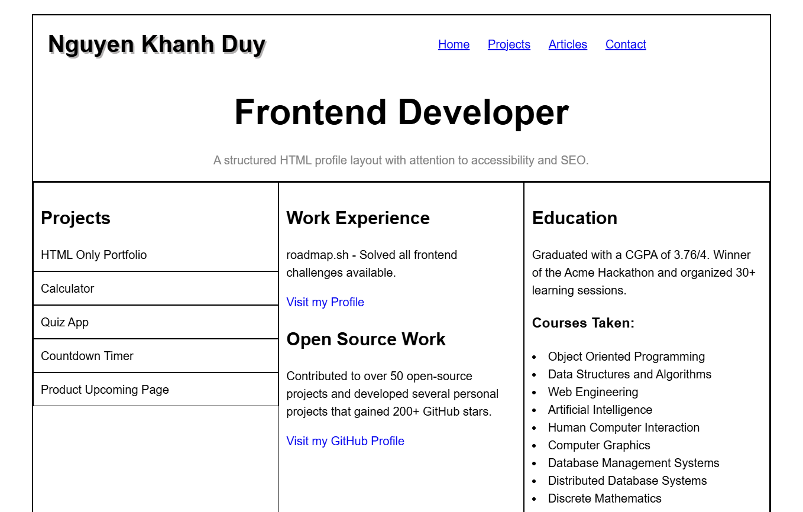

# Basic HTML Website Submission Checklist

## Checklist
- Semantically correct HTML structure.
- Responsive layout using CSS.
- Proper use of heading tags.
- Internal and external links functioning correctly.
- Accessibility considerations for navigation.
