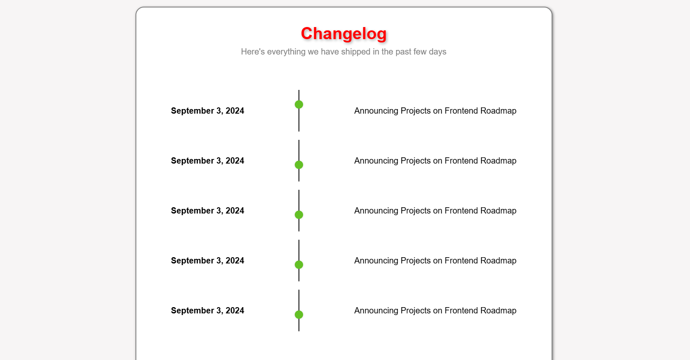

# Changelog Component Submission Checklist

## Checklist
- Semantically correct HTML structure.
- Clear layout with distinct sections for each change.
- CSS styling for readability.
- Proper use of lists for change items.
- Accessibility features for better usability.
