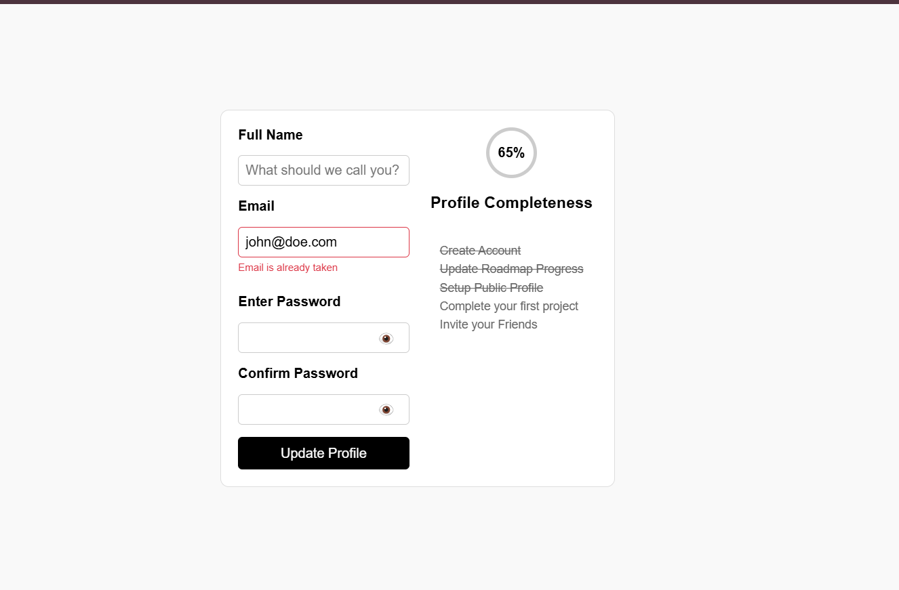

# Accessible Form UI

## Checklist
- Labeling: Ensure that each form field has a corresponding <label> element that is clearly associated with the field using the for attribute.
- Focus State: Style the focus state of each input field so that users navigating with a keyboard can easily see which field is currently active.
- Error Messaging: Consider adding space for error messages that can be displayed when a user inputs invalid data. These messages should be clearly associated with the relevant input field.
- ARIA Attributes: Use ARIA (Accessible Rich Internet Applications) attributes where necessary, such as aria-required for required fields and aria-invalid for fields with errors.
- Color Contrast: Ensure that the color contrast between text and background is sufficient to meet WCAG (Web Content Accessibility Guidelines) standards, making the form readable for users with visual impairments.
- Interactive Elements: Make sure that the button to show/hide the password is accessible via keyboard and screen readers, providing clear feedback on the current state (e.g., “Password is hidden” or “Password is visible”).